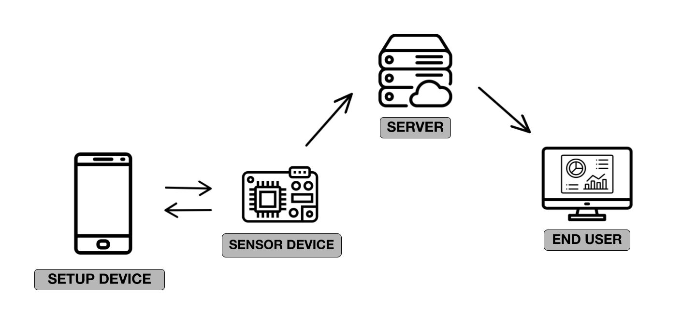

# M5Dot

  

## Summary
This project aimed to build a cost-effective, reliable, and modular product that can collect data, write it to a database and visualize it. This project was built upon the Sensoweb Labatory's current NewDot Product. The NewDot Product uses a Raspberry Pi computer and a seismic sensor. This project set out to develop a complementary project by integrating agit  more cost-effective microcontroller and an inertial measurement unit (IMU) sensor.

## ⚙️ Installation Instructions
The Installation for this product is as easy at three steps:
1. Install the broker on the server. Instructions can be found [here](https://github.com/walkiisun/M5Dot/tree/main/Server).
2. Pick which arduino script you want to run on the M5 Stick-C. For more information head to the [M5 Stick-C folder](https://github.com/walkiisun/M5Dot/tree/main/M5%20Stick-C). 
3. Using the [arduino IDE](https://www.arduino.cc/en/software), upload the script to the M5 Stick-C. Be sure to change the wifi settings if they are hard coded into the script.

## Getting Started 

## 📁 M5 Stick-C 
### Summary
The Sensor Device for the project was selected to be an M5 stick-C, an off the shelf microcontroller with an ESP32 chip and a 6 axis inertial measurement unit.   

On the device, a script is written to collect, synthesize, and publish the data to the server.

### **Files**
Some scripts scripts collect acceleration data while others collect angular velocity data. Some scripts use Kalman filtering to smooth the data. Some scripts collect data at a high sample rate while others collect data at a low sample rate. 

For more information about the scripts, head to the [M5 Stick-C folder](https://github.com/walkiisun/M5Dot/tree/main/M5%20Stick-C)

## 📁 Server  
### Summary
For this project we used the a server hosted on the Sensorweb Labatory at The University of Georgia. The server hosts a number of files and programs for our project. They are attached below
### Files and Programs
**Broker** - The instilation instructions for this broker are in the Server's README.md. In our project we used the EMQX MQTT broker. Once installed and running, a dashboard for for broker can he located at ipAddress:18083.

📄 **MQTT_Recieve.py** - This file subscribes to a topic on the MQTT Broker listens for messages. When a message is recieved, it calls the ServerFile.py file and passes the message to it.

📄 **ServerFile.py** - This file is called from MQTT_Revieve.py. This file parses the message that was sent over MQTT and writes it to a database.

📄 **config.yml** -  This files contains variables, usernames, ports, and passwords. 

## 📁 Test Files
This Folder contains files that were used to test the M5 Stick-C and the Server. It included test file for EAP connection, a file to write to influxDB, headless configuration file for the M5 Stick-C.  

## Troubleshooting 
1. Head to the dashboard of the broker after setting it up. The dashboard can be found at ipAddress:18083.
2. Make sure the topic of the M5 Stick-C matches the topic of the MQTT_Recieve.py file.
3. If you are trying to look at Grafana, make sure you input lowercase letters of the mac address. For example, if the mac address is 30:AE:A4:1C:2B:1C, then the mac address inputed into Grafana should be 30:ae:a4:1c:2b:1c.

